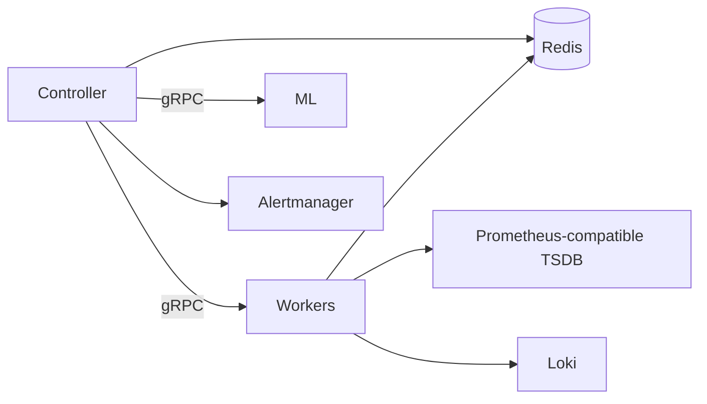

# anomaly-detection


Distributed anomaly detection for Kubernetes clusters. Combines adaptive statistical detection (Go controller + workers) with ML-based forecasting and multivariate analysis (Python).

**Source application**: [StaffOps/staffops-anomaly-detection](https://github.com/StaffOps/staffops-anomaly-detection)

## TL;DR

```bash
helm repo add staffops https://staffops.github.io/helm-charts/
helm repo update

helm install ad staffops/anomaly-detection \
  --namespace monitoring \
  --create-namespace \
  --set datasources.prometheus.url=https://prometheus.example.com/api/v1/query \
  --set datasources.loki.url=https://loki.example.com \
  --set datasources.alertmanager.url=https://alertmanager.example.com
```

## Architecture

The chart deploys five components:

| Component | Replicas | Purpose |
|-----------|----------|---------|
| Controller | 2 (HA via Lease) | Schedules detection cycles, correlates anomalies, fires alerts |
| Workers | 3 (stateless) | Execute VM/Loki queries and detection algorithms |
| ML service | 1 | Isolation Forest multivariate + Prophet forecasting |
| Redis | 1 (optional) | Baselines, dedup TTL, seasonal profiles |



## Prerequisites

- Kubernetes ≥ 1.24
- Helm ≥ 3.10
- Reachable Prometheus-compatible (Prometheus/Thanos/Cortex/VictoriaMetrics), Loki, and Alertmanager endpoints (the chart does NOT install them)
- Optional: Prometheus Operator (for PrometheusRule + ServiceMonitor), vm-operator (for VMServiceScrape), Grafana sidecar (for dashboard discovery)

## Installation

### Minimum installation

```bash
helm install ad staffops/anomaly-detection \
  --namespace monitoring \
  --create-namespace \
  --set clusterName=prd-eks \
  --set datasources.prometheus.url=https://prometheus.example.com/api/v1/query \
  --set datasources.loki.url=https://loki.example.com \
  --set datasources.alertmanager.url=https://alertmanager.example.com
```

### Production install with external Redis and observability integration

```yaml
# values-prd.yaml
clusterName: prd-eks

datasources:
  prometheus:
    url: https://vm.internal/select/0/prometheus
  loki:
    url: https://loki.internal
  alertmanager:
    url: https://alertmanager.internal

controller:
  replicaCount: 2
  dryRun: false       # promote to live alerts

redis:
  enabled: false      # use external
  external:
    addr: redis-prd.cache.amazonaws.com:6379
    existingSecret: redis-credentials

vmServiceScrape:
  enabled: true

prometheusRule:
  enabled: true

grafanaDashboard:
  enabled: true

podDisruptionBudget:
  controller:
    enabled: true
  worker:
    enabled: true

links:
  grafanaBaseUrl: https://grafana.example.com
  tempoBaseUrl: https://grafana.example.com
  lokiBaseUrl: https://grafana.example.com
  runbookBaseUrl: https://docs.example.com/runbooks
```

```bash
helm install ad staffops/anomaly-detection \
  --namespace monitoring -f values-prd.yaml
```

## Upgrading

```bash
helm repo update
helm upgrade ad staffops/anomaly-detection -n monitoring -f values-prd.yaml
```

Upgrades preserve baselines if `redis.persistence.enabled=true` or external Redis is used. Otherwise, baselines warm up again from scratch (~30 minutes at 30s tick interval).

## Configuration

See `values.yaml` for the full schema with comments. Key values:

### Required

| Key | Description |
|-----|-------------|
| `clusterName` | Cluster identity, used as the `cluster` label on all metrics |
| `datasources.prometheus.url` | Prometheus-compatible read endpoint (PromQL) |
| `datasources.loki.url` | Loki read endpoint (LogQL) |
| `datasources.alertmanager.url` | Alertmanager v2 endpoint |

### Image

| Key | Default | Description |
|-----|---------|-------------|
| `image.registry` | `ghcr.io` | Container registry |
| `image.repository` | `karlipegomes/staffops-anomaly-detection` | Controller/worker image |
| `image.tag` | `""` (uses `.Chart.AppVersion`) | Image tag |
| `ml.image.repository` | `karlipegomes/staffops-anomaly-detection-ml` | ML service image |

### Controller / Workers / ML

| Key | Default | Description |
|-----|---------|-------------|
| `controller.replicaCount` | `2` | Controller replicas (HA) |
| `controller.dryRun` | `true` | Log alerts without dispatching to Alertmanager |
| `controller.leaderElection.enabled` | `true` | K8s Lease leader election |
| `worker.replicaCount` | `3` | Worker replicas |
| `worker.concurrency` | `5` | Parallel jobs per worker |
| `ml.enabled` | `true` | Toggle ML service |

### Redis

| Key | Default | Description |
|-----|---------|-------------|
| `redis.enabled` | `true` | Deploy in-cluster Redis (single replica) |
| `redis.persistence.enabled` | `false` | PVC for Redis data |
| `redis.external.addr` | `""` | External Redis address (when `enabled=false`) |
| `redis.external.existingSecret` | `""` | Secret with `redis-password` key |

### Suppression / Detection

| Key | Description |
|-----|-------------|
| `suppression.excludeNamespaces` | Namespaces fully excluded from detection |
| `suppression.excludeStaticOnly` | Namespaces where static rules suppressed but adaptive still fires |
| `detection.staticRules` | Static threshold rules |
| `detection.adaptiveMetrics` | Adaptive (Z-Score) metric rules |
| `detection.logPatterns` | Loki-based log rate detection |

### Observability integrations

| Key | Default | Description |
|-----|---------|-------------|
| `serviceMonitor.enabled` | `false` | Prometheus Operator ServiceMonitor |
| `vmServiceScrape.enabled` | `false` | vm-operator VMServiceScrape |
| `prometheusRule.enabled` | `false` | PrometheusRule (health alerts + recording rules) |
| `grafanaDashboard.enabled` | `false` | ConfigMap labelled for Grafana sidecar discovery |

## Uninstalling

```bash
helm uninstall ad -n monitoring
```

If `redis.enabled=true` and `redis.persistence.enabled=true`, the PVC remains. Delete manually:

```bash
kubectl delete pvc -n monitoring -l app.kubernetes.io/name=anomaly-detection
```

## Validation

After install, verify the stack:

```bash
# Pods running
kubectl get pods -n monitoring -l app.kubernetes.io/name=anomaly-detection

# Controller readiness probes
kubectl exec -n monitoring deploy/ad-anomaly-detection-controller -- \
  wget -qO- http://localhost:8080/readyz

# Metrics exposed
kubectl port-forward -n monitoring svc/ad-anomaly-detection-controller 8080:8080 &
curl -s localhost:8080/metrics | grep staffops_ad_controller_cycles_total
```

## Troubleshooting

| Symptom | Cause | Fix |
|---------|-------|-----|
| `/readyz` returns 503 | Datasource unreachable | Check controller logs for which probe failed (VM/Loki/AM) |
| No anomalies after 30 min | Baselines still warming up | Wait for `warm_up_samples * job_interval` (default 30 min) |
| Both controllers running cycles | Leader election misconfigured | Check `controller_is_leader` metric and Role/RoleBinding |
| Workers `connectivity = TransientFailure` | gRPC service discovery broken | Check headless service has `clusterIP: None` |

## Source links

- App source: <https://github.com/StaffOps/staffops-anomaly-detection>
- Chart source: <https://github.com/StaffOps/helm-charts/tree/main/charts/anomaly-detection>
- Documentation: <https://github.com/StaffOps/staffops-anomaly-detection/tree/main/docs>
